CMPE272-mini-project-2

#Topic: Health datasets analysis.

#Why do we want to do this?
We are entitled to access to the IBM Bluemix cloud platform this semester in the course CMPE 272.
            
And we have also obtained some datasets from Bluemix in public health domain. And we want to employ the API services in Bluemix to analyse the health expenditure, life expectancy and HIV/AIDS suffering people in different countries to see if there is any relationship between them.

#1. Datasets
I Use the health datasets in Bluemix:
Country Statistics: Life Expectancy at Birth
Country Statistics: Health Expenditures
Country Statistics: HIV/AIDS - People Living With HIV/AIDS
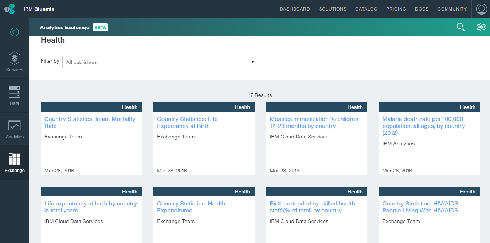

#2. APIs and containers that we have uesd
We are using Apache Spark API(Bluemix Service) for data analysis and Python Flask(Bluemix boilerplate) for building a website to demonstrate the result of analysis.

The source code and result in iPython can be found on the Github:
https://github.com/GingerHugo/CMPE272-mini-project-2

The URL of the webpage is:
http://272-miniproject.mybluemix.net/

Some screenshots of codes:

Sorting
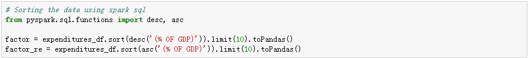

Join
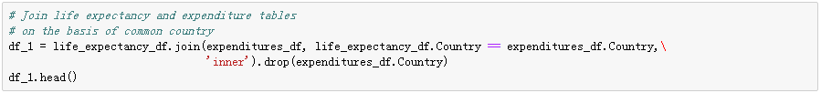

Correlation coeffient calculation
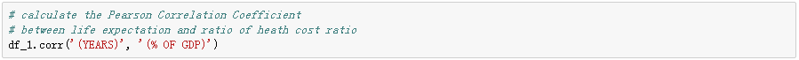

#3. Explore Data(statistics)

Health expenditure:
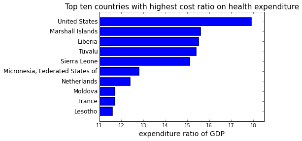
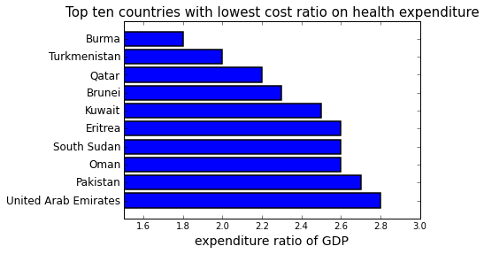

Life expectancy:
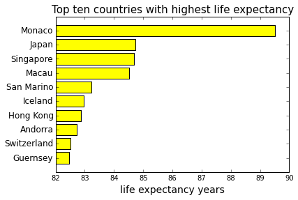
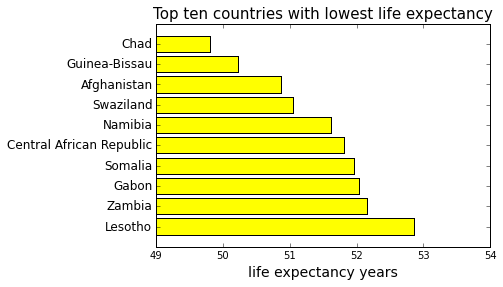

HIV/AIDS suffering people number:
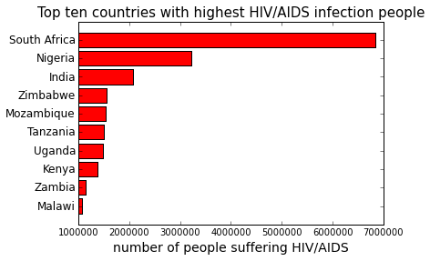

#4. Further analysis

Compare between life expectancy and health expenditure:
correlation coefficient = 0.1578
covariance = 3.8624

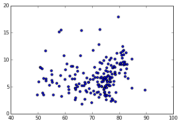

Compare between life expectancy and HIV/AIDS suffering people:
correlation coefficient = -0.2660
covariance = -1776240.6170

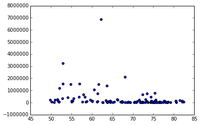

Compare between health expenditure and HIV/AIDS suffering people:
correlation coefficient = 0.0242
covariance = 44419.4852

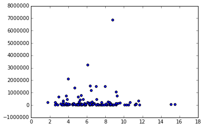

